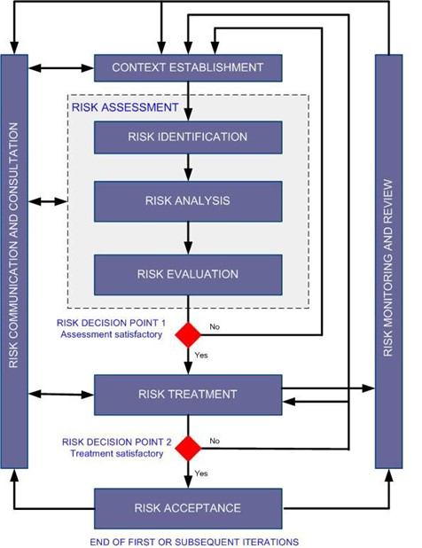
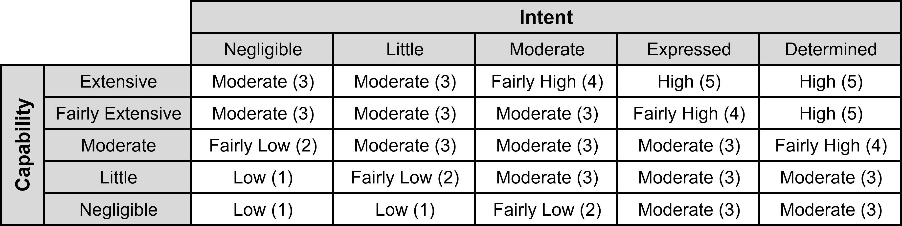
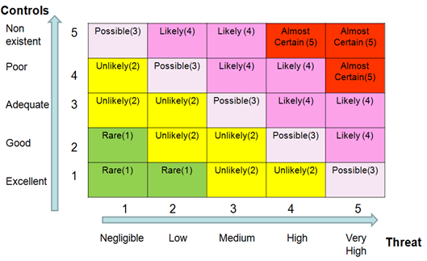
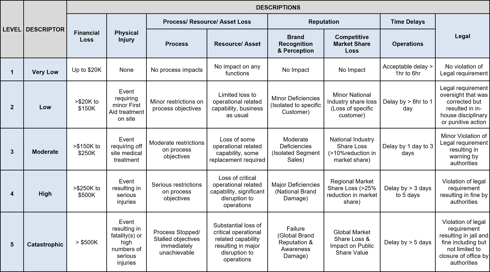
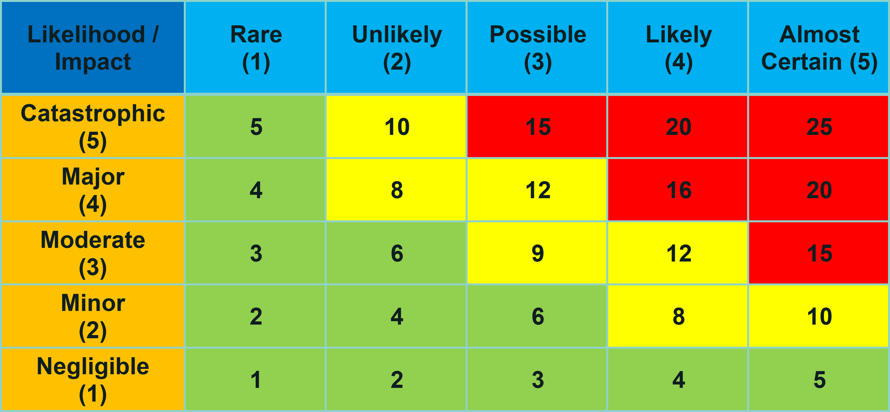

# Nexraid ISMS Procedure 05 - Risk Methodology for Information Security and Privacy Risk

## Document Details
* Doc ID: ISMSP05
* Doc Title: Risk Methodology for Information Security and Privacy Risk
* Revision: 2.0
* Effective Date: 1 August 2022
* Reference: ISO 27001 Clause 6.1, 8.2, 8.3 and ISO 27701 Clause 5.4.1.2 and 5.4.1.3
* Author: Danny Tan
* Approver: Liu Lung Hao

## Compliance objectives ISO/IEC 27001:2013 and ISO 27701:2019
### ISO 27001:2013
| Clause | Header                                                                | Remark |
|:-------|:----------------------------------------------------------------------|:-------|
| 6.1.2  | Information security risk assessment                                  |        |
| 6.1.3  | Information security risk treatment                                   |        |
| 6.2 c  | Information security objectives and planning to achieve them          |        |
| 8.2    | Operation - Information security risk assessment                      |        |
| 9.3 e  | Mgmt Review – Results of assessment and status of risk treatment plan |        |

### ISO 27701:2019
| Clause  | Header                                                                                                     | Remark |
|:--------|:-----------------------------------------------------------------------------------------------------------|:-------|
| 5.4.1.2 | Information security risk assessment taking into consideration the scope of Privacy Information Management |        |
| 5.4.1.3 | Information security risk treatment taking into consideration the scope of Privacy Information Management  |        |

## Responsibility and Roles

### Head of Department (HOD)
If not otherwise waived, the HOD supports and oversees the risk management related to department’s critical assets including Personal Identifiable Information (PII). The HOD is by default the risk owner of all risk associated directly to the respective department. He also ensures that risks related to assets supporting his operations are effectively managed.

### Head of IT
Has the responsibility to oversee risk as management related to supporting ICT assets including Personal Identifiable Information (PII) taken in considerations needs of the HOD.

### Management Representative (MR)
Oversees and coordinate the over risk management process; including risk assessment; risk treatments and evaluation of effectiveness of the programs and ensures that risk management processes are aligned with applicable requirements defined in ISO/IEC 27001 and ISO 27701 and specified in SLAs, inclusive of any laws and regulations.

## Process overview
The following flow provides a sequential representation of the organisation’s security risk assessment process and the necessary action and documentation required to support this process.

1. Determine Risk Criteria
    * Risk assessment criteria
  	* Risk evaluation criteria includes:
        * Impact criteria
        * Risk acceptance criteria
2. Asset Categorization and Ownership
    * Two kinds of assets, each belongs to one category
    * Assets are assigned to owners
3. Determine Evaluation Criteria
    * Executive Endorsement of Policy & Matrices:
		* Consequence Table
		* Likelihood Table
		* Control Effectiveness Table
			   * R = C x L Table
4. Critical Asset Valuation
    * Conduct Valuation of Asset (Asset Valuation Tables)
5. Threats
    * Consider Internal Threats
    * Consider External Threats
    * Derive possible threat sources from relevant industry sources:
    * Consider Threat Scenarios
    * Determine the risk to the asset
    * Determine Intent.
    * Rate intent using categories; Little | Expressed | Determined
    * Determine Capability
    * Rate capability using categories; Low | Moderate | Extensive
    * Determine Impact of Threat
    * Rate Threat using Qualitative Threat Matrix (Threat Assessment Table)
6. Control Effectiveness
    * List Controls for Organisation | Physical | Technology | Procedural
    * Determine Control Effectiveness by assessment of Deter | Detect | Deny | Respond | Recover characteristics
    * Grade Control Effectiveness (Control Effectiveness Table)
7. Vulnerability
    * Determine weakness of an asset or control that can be exploited by a threat and link with threat assessment.
8. Plot Information
    * Transfer information from Threat Assessment Form & Critical Asset Vulnerability Form into the ‘Risk Register’ and allocate a Risk ID for each Threat Scenario identified
    * Issue Risk ID 
    * Cross Ref Risk ID with Threat Assessment (Risk Register)
9. Risk Rating
    * Determine the Impact & Likelihood of the Threat
    * Determine the Risk Rating (Consequence X Likelihood)
        * Impact Table
        * Likelihood Table
        * Risk Rating Matrix
        * Risk Register
10. Risk Evaluation
    * Determine if Risk rating is within or outside of the organisations level of risk tolerance to determine if further action is required. ISMS Committee may need to be consulted.
    * Refer to organisations risk tolerance guidelines and/or refer to Senior Management
11. Treatment Program
    * Risk Rating outcome
    * Determine new controls or adjust/ enhance existing controls
    * Establish Security Management Objectives, 
    * Establish Security Management Targets
    * Perform Cost Benefit Analysis
    * Develop and agree Treatment strategy
    * Create Timetable & Milestones
    * Responsibilities for implementation, review and reporting
    * Reference this form to Risk Register
    * Security Mgt Program 

> Critical asset is either a supporting asset or a primary asset, see the definition.

> Need to distinguish the cost of replacing an asset if lost or damaged from the value of an asset by its function. For example, a firewall might have a replacement value of 1000 USD; but if not functioning the impact might be much bigger than 1000 USD.

The process closely follows the recommended risk assessment process flow of ISO 31000, reproduced below:

## Procedure
### Conducting Risk Assessments
* Risk assessments can be conducted by various means in diverse context. The scope of a particular risk assessment might be restricted to specific areas like product/software design, process design or ICT infrastructure issues. 
* It is the responsibility of management to allocate sufficient resources for an effective risk assessment and treatment.

### Ad-hoc Informal High-level and Formal Detail Assessments
* Information security risk assessment can be ad-hoc informal at all times or formally planned. Ad-hoc risk assessments may take place at any time and might be part of any business meetings or process. Ad-hoc informal assessments might complement formal assessments. Results of ad-hoc risk assessment shall be communicated to the MR.
* Information security risk assessment might follow a more general business impact assessment conducted in the context of company’s business continuity planning.
* The MR is responsible to aggregate risk assessment results and to ensure that identified risks are tracked and mitigated as expected.
* A formal risk assessment process is based on the process defined in this procedure and managed in compliance with ISO/IEC 27001:2013 and ISO/IEC 27701:2019 requirements.

### Risk Assessment Criteria
* Risk evaluation criteria guides the company in conducting risk assessments.
* Risk evaluation criteria are defined in order to identify, evaluate, treat and accept information security risks related to operations, service, product design, production process and design of software and firmware. Risk assessment criteria might change depending on a changing business environment in which the company operates.
* Risk assessment criteria include:
   * Criteria for performing risk assessment
   * Risk evaluation criteria
   * Impact criteria
   * Risk acceptance criteria
* Identifying and communicating risk assessment criteria and ensures that they are understood by all participants of a risk assessment process. 

### Criteria for Performing Risk Assessment
A formal risk assessment will be performed at least once a year. The following event shall be considered for conducting risk assessments.
* New customers
* Near misses
* Significant changes in technology
* Changes under control of a formal change management process
* Preparing SLA
* Changes in legal requirements
* Changes to senior leadership team
* Merger and acquisitions
* Emerging ITC threats

### Risk evaluation criteria include:
* The strategic value of business information and IP
* The criticality of information assets used by the company
* Contractual obligations, legal and regulatory requirements related services and products
* Operational and business importance of availability, confidentiality and integrity of assets and products
* Stakeholder’s expectations and perceptions, and negative consequences for goodwill and reputation in case of any security breach or incident related to products and processes. Special attention shall be given to utilities’ requirements and expectation

Each HOD is responsible to identify and communicate additional risk evaluation criteria internally.

### Impact Criteria
Impact criteria are specified in terms of the degree of damage or cost caused by an information security event (processes, product, infrastructure).

This includes risks of 
* Production loss
* Financial loss
* Level of classification of the impacted information asset, if classified
* Breaches of information security (e.g., loss of confidentiality, integrity and availability)
* Impaired operations (internal or third parties)
* Loss of business and financial value
* Disruption of plans and deadlines, IP loss
* Damage of reputation
* Breaches of legal, regulatory or contractual requirements

### Risk Acceptance Criteria
* Acceptance of residual risks (risk remaining after treatment or existing under consideration of current controls in place) is based on decisions of owner of assets in the scope of the assessment. Acceptance of any risk, which might affect the overall business of the company shall be reviewed and evaluated in cooperation with the MR.
* Acceptance of risks related to risks related to contractual and legal requirements shall be reviewed by top management and signed-off by senior management 

### Defining Asset Types
In order to identify and manage assets, there are two kinds of assets (primary and secondary) and are categorized in the following:

| Asset type                              | Kind       | Remark / Example                                                                                                                               |
|:----------------------------------------|:----------:|:-----------------------------------------------------------------------------------------------------------------------------------------------|
| Information / Data / Know How           | Primary    | Information is interpreted data. Knowledge is information, which is used to implement tasks, processes and to implement solutions, crypto keys |
| Product related information             | Primary    | Technical data defining company’s products, including software, firmware, hardware specification                                               |
| Internal Business processes             | Primary    | Interlink functions between each and every department of the company, how each department performs its assigned tasks                          |
| Service processes                       | Primary    | How each department performs its tasks to achieve customers’ requirements and KPIs                                                             |
| Service components                      | Primary    | Assets, components which support service processes                                                                                             |
| Personal Identifiable Information (PII) | Primary    | Collection, processing, storage of PII                                                                                                         |
| Soft asset                              | Supporting | Software used to support primary assets                                                                                                        |
| Physical asset                          | Supporting | Hardware, Equipment, Facility, Server used to support a primary asset including management of customer’s servers on their premises             |
| Support Process                         | Supporting | Processes supporting primary assets. E.g., key management process                                                                              |
| Control mechanism                       | Supporting | Mechanism or device used to protect or control assets: E-mail encryption                                                                       |
| Internal ICT Services                   | Supporting | Services provided by IT to the company, this includes provision of network services, storage facilities, security services                     |
| External ICT Services                   | Supporting | Services provided by any external party to the company                                                                                         |
| ICT Systems                             | Supporting | All components in an information communication technology system                                                                               |
| Others                                  | Supporting | Anything, which can be affected by incidents but not listed above                                                                              |

### Evaluation Value of Assets
* Asset values are based on the potential impact, which an incident might have on the overall operation of the company as well as on replacement cost of the asset.
* An asset value might be revised after the risk analysis.
* Each asset can be assigned with two scores between 1 and 5.
    * One score is representing the replacement value of the asset and is based on a monetary value;
    * the other score represents a non-monetary (or a value difficult to express in monetary units) and must be seen in context with the system in which it is used and its criticality.
* Assigning an asset value shall take in account all stakeholders.
* There can be different asset values assigned by different stakeholders.

### Valuation of Information Security Assets
* Values of information assets should be characterized in terms of its protection properties:
    * Confidentiality
    * Integrity
    * Availability
    * Regulatory
* The protection properties and rating are indicated in the critical asset register and taken into account during risk identification and overall risk assessment in forming the risk register.
* Asset register with Protection Properties:
    * The value and sensitivity of an information asset can be also evaluated in terms of the worst-case scenarios that could be reasonably expected to happen from adverse business consequences due to unauthorized disclosure, unauthorized modification, non-availability for varying time periods, destruction, loss of confidentiality, integrity, availability and affecting regulatory requirements.

#### Monetary & Non-Monetary Evaluation
| Score | Monetary Asset Scoring | Non-Monetary Asset Scoring                                                                                                                                                                                                                                                                                             |
|:-----:|:----------------------:|:-----------------------------------------------------------------------------------------------------------------------------------------------------------------------------------------------------------------------------------------------------------------------------------------------------------------------|
| 5     | > $500,000             | Mission critical asset: any loss in terms confidentiality, integrity or availability can lead to major interruption of business processed, loss of reputation, competitiveness of the Company. Replacement cost is extreme high.                                                                                       |
| 4     | >$250,000 to $500,000  | A significant impact on business is inflicted, but it is not IT mission critical                                                                                                                                                                                                                                       |
| 3     | >$150,000 to $250,000  | Any loss in terms of confidentiality, integrity or availability of the affected asset has a significant impact on a business process but the impact is limited to a particular business unit and does not affect a customer or regulatory compliance. Replacement of the asset does not have a major financial impact. |
| 2     | > $20,000 to $150,000  | A repeating incident that can lead to significant losses.                                                                                                                                                                                                                                                              |
| 1     | up to $20,000          | Insignificant, any loss in terms of confidentiality, integrity or availability of the affected asset cannot lead to significant interruption of business process, loss of reputation or competitiveness. The asset is easily to replace.                                                                               |

#### Guidance on Valuation - Asset Valuation Table:

| Score | Remark / Example                                                                                                                                                                                                                                                                                                       |
|:-----:|:-----------------------------------------------------------------------------------------------------------------------------------------------------------------------------------------------------------------------------------------------------------------------------------------------------------------------|
| 1     | Insignificant, any loss in terms of confidentiality, integrity or availability of the affected asset cannot lead to significant interruption of business process, loss of reputation or competitiveness. The asset is easily to replace.                                                                               |
| 2     | A repeating incident can have led to significant losses.                                                                                                                                                                                                                                                               |
| 3     | Any loss in terms of confidentiality, integrity or availability of the affected asset has a significant impact on a business process but the impact is limited to a particular business unit and does not affect a customer or regulatory compliance. Replacement of the asset does not have a major financial impact. |
| 4     | A significant impact on business is inflicted, but it is not IT mission critical                                                                                                                                                                                                                                       |
| 5     | Mission critical asset: any loss in terms confidentiality, integrity or availability can lead to major interruption of business processed, loss of reputation, competitiveness of the company. Replacement cost is extreme high.                                                                                       |

> Each department manager is responsible to maintain a register of its primary assets. IT department maintains a register of all supporting IT assets

## Identification of Vulnerabilities
There are different categories of vulnerabilities to be considered. Vulnerabilities can be classified in the following category of weakness:
* Organization and policy
* Dependence on external party
* Processes and procedures
* Management routines
* Personnel
* Physical environment
* Information system configuration
* Hardware
* Software
* Coding vulnerability
* Communications equipment

### Identification of Technical Vulnerabilities
Technical vulnerability shall be evaluated based on publicly available sources for vulnerability information. These include but are not limited to:
1. “Open Web Application Security Project (OWASP)” Top 10 Vulnerabilities for web application design
    * https://www.owasp.org/index.php/Main_Page
2. CWE/SANS Top 25 Most Dangerous Software Errors
3. National Vulnerability Database Common Weakness Enumeration (CWE) vulnerabilities
    * http://nvd.nist.gov/cwe.cfm

IT manager is responsible to get up-to-date information about vulnerabilities relevant for supporting IT assets.

### Vulnerabilities in Software, Firmware and Related Services
* Specific attention shall be given to vulnerabilities in software design.
* It is the responsibility of the manager of the respective department to ensure that vulnerabilities are timely identified and addressed.
* Vulnerabilities shall be evaluated with reference to current controls.
* Each department manager is responsible to identify vulnerabilities and to maintain a register of vulnerabilities of its primary assets.
* IT department maintains a register of vulnerabilities of supporting IT assets.
* Annex A of ISO/IEC 27001:2013 (ISO/IEC 27002:2013) shall be utilized during the risk assessment process in order to identify further threats and vulnerabilities.

### Vulnerabilities in Current Controls
* After identification of threats, existing controls to counter these threats shall be identified and documented.
* Controls can vary from technical measure to awareness measures. An existing procedure might be a control, documented or not.
* The need of documenting of controls depends on the complexity of tasks involved.
* Depending on the scope of the risk assessment, different types of vulnerabilities are identified. Vulnerabilities are identified with reference to diverse sources.

### Current Control Effectiveness Rating Matrix
| Score | Control Rating       | Description                                                                                      |
|:-----:|:--------------------:|:-------------------------------------------------------------------------------------------------|
| 1     | Very Effective       | Rare that the control fails in a given time frame (until the next time of assessment)            |
| 2     | Effective            | Fairly Rare that the control fails in a given time frame (until the next time of assessment)     |
| 3     | Moderately Effective | Moderate chance that the control fails in a given time frame (until the next time of assessment) |
| 4     | Partially Effective  | Fairly Certain that the control fails in a given time frame (until the next time of assessment)  |
| 5     | Not Effective        | Certain that the control fails in a given time frame (until the next time of assessment)         |

## Identification of Threats
* Considering of an incident scenario might help to identify threats and vulnerabilities. Such scenarios shall be documented.
* Depending on the scope of the risk assessment, different types of threats shall be considered. Under guidance of the chairman threats to assets and threat sources are identified. Threats can be of different nature: environmental, accidental, and malicious.
* Threats might relate to:
   * Critical infrastructure requirements in the target market
   * General information security
   * Others, which might relate indirectly to information security. E.g., threat of fire due to wrong device configuration
* Diagram in the Annex might be used to identify threats. If needed, it should be amended accordingly.
* Each department manager is responsible to maintain a register of threats applicable to its primary assets.
* IT maintains a register of all threats to supporting IT assets

### Threat Rating Matrix

### Likelihood Rating Table

### Impact Evaluation

## Ensuring Security Risk Assessments Produce Consistent, Valid and Comparable Results 
Consistency, validity and comparability of risk assessment result are reviewed at least during internal audits and after each incident or near miss.

### Setting Risk Management Objectives
The results of risk assessments are prioritized, and related risk management objectives determined

### Risk Treatment Planning
Once priorities for risk treatments have been decided appropriate risk treatment plans has to be established.

### Overall Risk Rating

## Glossary - Definitions/Abbreviations
If not otherwise defined the following terms are binding.

### Asset:
* Any information, service, system, device, process that has value to the company or its stakeholder and which needs protection in terms of confidentiality, integrity, availability, non-repudiation, accountability, authenticity and reliability. 
* Assets are of two kinds: **Primary Assets** and **Supporting Assets**. 
   * Primary Assets are assets like business processes and information directly creating value for the organization;
   * Supporting Assets are assets on which primary assets rely on or assets which are used to protect primary assets.

   
### Asset Owner / Asset Stakeholder:
Identifies a role, individual or business unit that has approved management responsibility for controlling the production, development, maintenance, use and security of assets. The term ’owner’ does not mean that the person actually has any property rights to the asset. Any entity is called a stakeholder if it has specific interest in the asset. E.g., expectations in protection of confidentiality (a utility, consumer using smart meters). An owner is a specific type of stakeholder.

### Consequence:
Outcome of an event affecting security and finally achievement of business objectives.

### Risk:
Effect of uncertainty on information security or on business objectives of the company and its stakeholders. Information security risk is expressed in terms of a combination of the consequences of an information security event and the associated likelihood of occurrence. Information security risk is associated with the potential that threats will exploit vulnerabilities of an information asset and thereby cause harm to an organization.

### Residual Risk:
Risk remaining after risk treatment

### Risk Owner:
Person or entity with the accountability and authority to manage a risk

### Risk Assessment:
Overall process of risk identification, risk analysis and risk evaluation

### Risk Identification:
Process of finding, recognizing and describing risks. Risk identification also involves the identification of risk sources, events, their causes and their potential consequences; it can involve historical data, theoretical analysis, informed and expert opinions, and stakeholders’ needs.

### Risk Analysis:
Process to comprehend the nature of risk and to determine the level of risk. Risk analysis also provides the basis for risk evaluation and decisions about risk treatment.

### Risk Evaluation:
Process of comparing the results of risk analysis with risk criteria to determine whether the risk and/or its magnitude are acceptable or tolerable.

### Risk Treatment:
Process to modify risk. Avoiding the risk by deciding not to start or continue with the activity that gives rise to the risk; taking or increasing risk in order to pursue an opportunity; removing the risk source; changing the likelihood; changing the consequences; sharing the risk with another party or parties (including contracts and risk financing); and retaining the risk by informed choice.

### Threat:
Potential cause of an incident, which may result in harm to the company’s product. IT systems or the organization

### Vulnerability:
Weakness of an asset or control that can be exploited by a threat

## Information Security Threats Examples
Taken from ISO 27005 – Conduct an information security risk assessment

### Physical Damage
| Threats                                            | Origin  |
|:---------------------------------------------------|:-------:|
| Fire                                               | A, D, E |
| Water Damage                                       | A, D, E |
| Pollution                                          | A, D, E |
| Major Accident                                     | A, D, E |
| Destruction of Equipment or Media                  | A, D, E |
| Dust, Corrosion, Freezing                          | A, D, E |

### Natural Events
| Threats                                            | Origin  |
|:---------------------------------------------------|:-------:|
| Climatic Phenomenon                                | E       |
| Seismic Phenomenon                                 | E       |
| Volcanic Phenomenon                                | E       |
| Meteorological Phenomenon                          | E       |
| Flood                                              | E       |

### Loss of Essential Services
| Threats                                            | Origin  |
|:---------------------------------------------------|:-------:|
| Failure of Air-Conditioning or Water Supply System | A, D    |
| Loss of Power Supply                               | A, D, E |
| Failure of Telecommunication Equipment             | A, D    |

### Disturbance Due to Radiation
| Threats                                            | Origin  |
|:---------------------------------------------------|:-------:|
| Electromagnetic Radiation                          | A, D, E |
| Thermal Radiation                                  | A, D, E |
| Electromagnetic Pulses                             | A, D, E |

### Compromise of Information
| Threats                                            | Origin  |
|:---------------------------------------------------|:-------:|
| Interception of Compromising Interference Signals  | D       |
| Remote Spying                                      | D       |
| Eavesdropping                                      | D       |
| Theft of Media or Documents                        | D       |
| Theft of Equipment                                 | D       |
| Retrieval of Recycled or Discarded Media           | D       |
| Disclosure                                         | A, D    |
| Data From Untrustworthy Sources                    | A, D    |
| Tampering with Hardware                            | D       |
| Tampering with Software                            | A, D    |
| Position Detection                                 | D       |

### Technical Failures
| Threats                                            | Origin  |
|:---------------------------------------------------|:-------:|
| Equipment Failure                                  | A       |
| Equipment Malfunction                              | A       |
| Saturation of the Information System               | A, D    |
| Software Malfunction                               | A       |
| Breach of Information System Maintainability       | A, D    |

### Unauthorised Actions
| Threats                                            | Origin  |
|:---------------------------------------------------|:-------:|
| Unauthorised Use of Equipment                      | D       |
| Fraudulent Copying of Software                     | D       |
| Use of Counterfeit or Copied Software              | A, D    |
| Corruption of Data                                 | D       |
| Illegal Processing of Data Including PII           | D       |

### Compromise of Functions
| Threats                                            | Origin  |
|:---------------------------------------------------|:-------:|
| Error In Use                                       | A       |
| Abuse of Rights                                    | A, D    |
| Forging of Rights                                  | D       |
| Denial of Actions                                  | D       |
| Breach of Personnel Availability                   | A, D, E |

## Origin of Threat Examples
| Origin of Threat                                                                                 | Motivation                                                                                                                           | Possible Consequences                                                                                                                                                                                                                                                                                                                            |
|:-------------------------------------------------------------------------------------------------|:-------------------------------------------------------------------------------------------------------------------------------------|:-------------------------------------------------------------------------------------------------------------------------------------------------------------------------------------------------------------------------------------------------------------------------------------------------------------------------------------------------|
| Hacker, Cracker                                                                                  | Challenge, Ego, Rebellion, Status, Money                                                                                             | Hacking, Social Engineering, System Intrusion, Break-Ins, Unauthorized System Access                                                                                                                                                                                                                                                             |
| Computer Criminal                                                                                | Destruction of Information, Illegal Information Disclosure, Monetary Gain, Unauthorized Data Alteration                              | Computer Crime (E.G., Cyber Stalking), Fraudulent Act (E.G., Replay, Impersonation, Interception), Information Bribery, Spoofing, System Intrusion                                                                                                                                                                                               |
| Terrorist                                                                                        | Blackmail, Destruction, Exploitation, Revenge, Political Gain, Media Coverage                                                        | Bomb/Terrorism, Information Warfare, System Attack (E.G., Distributed Denial of Service), System Penetration, System Tampering                                                                                                                                                                                                                   |
| Industrial Espionage (Intelligence, Companies, Foreign Governments, Other Government Interests)  | Competitive Advantage, Economic Espionage                                                                                            | Defence Advantage, Political Advantage, Economic Exploitation, Information Theft, Intrusion On Personal Privacy, Social Engineering, System Penetration, Unauthorized System Access (Access to Classified, Proprietary, and/or Technology-Related Information)                                                                                   |
| Insiders (Poorly Trained, Disgruntled, Malicious, Negligent, Dishonest, or Terminated Employees) | Curiosity, Ego, Intelligence, Monetary Gain, Revenge, Unintentional Errors And Omissions (E.G., Data Entry Error, Programming Error) | Assault On An Employee, Blackmail, Browsing of Proprietary Information, Computer Abuse, Fraud And Theft, Information Bribery, Input of Falsified, Corrupted Data, Interception, Malicious Code (E.G., Virus, Logic Bomb, Trojan Horse), Sale of Personal Information, System Bugs, System Intrusion, System Sabotage, Unauthorized System Access |

## Examples for Vulnerabilities
### Hardware
| Examples of Vulnerabilities                                                                            | Examples of Threats                          |
|:-------------------------------------------------------------------------------------------------------|:---------------------------------------------|
| Insufficient Maintenance/Faulty Installation of Storage Media                                          | Breach of Information System Maintainability |
| Lack of Periodic Replacement Schemes                                                                   | Destruction of Equipment or Media            |
| Susceptibility To Humidity, Dust, Soiling                                                              | Dust, Corrosion, Freezing                    |
| Sensitivity To Electromagnetic Radiation                                                               | Electromagnetic Radiation                    |
| Lack of Efficient Configuration Change Control                                                         | Error In Use                                 |
| Susceptibility To Voltage Variations                                                                   | Loss of Power Supply                         |
| Susceptibility To Temperature Variations                                                               | Meteorological Phenomenon                    |
| Unprotected Storage                                                                                    | Theft of Media or Documents                  |
| Lack of Care At Disposal                                                                               | Theft of Media or Documents                  |

### Software
| Examples of Vulnerabilities                                                                            | Examples of Threats                          |
|:-------------------------------------------------------------------------------------------------------|:---------------------------------------------|
| Uncontrolled Copying                                                                                   | Theft of Media or Documents                  |
| No or Insufficient Software Testing                                                                    | Abuse of Rights                              |
| Well-Known Flaws In The Software                                                                       | Abuse of Rights                              |
| No 'Logout' When Leaving The Workstation                                                               | Abuse of Rights                              |
| Disposal or Reuse of Storage Media Without Proper Erasure                                              | Abuse of Rights                              |
| Lack of Audit Trail                                                                                    | Abuse of Rights                              |
| Wrong Allocation of Access Rights                                                                      | Abuse of Rights                              |
| Widely Distributed Software                                                                            | Corruption of Data                           |
| Applying Application Programs To The Wrong Data In Terms of Time                                       | Corruption of Data                           |
| Complicated User Interface                                                                             | Error In Use                                 |
| Lack of Documentation                                                                                  | Error In Use                                 |
| Incorrect Parameter Set Up                                                                             | Error In Use                                 |
| Incorrect Dates                                                                                        | Error In Use                                 |

### Network
| Examples of Vulnerabilities                                                                            | Examples of Threats                          |
|:-------------------------------------------------------------------------------------------------------|:---------------------------------------------|
| Lack of Identification and Authentication Mechanisms Like User Authentication                          | Forging of Rights                            |
| Unprotected Password Tables                                                                            | Forging of Rights                            |
| Poor Password Management                                                                               | Forging of Rights                            |
| Unnecessary Services Enabled                                                                           | Illegal Processing of Data                   |
| Immature or New Software                                                                               | Software Malfunction                         |
| Unclear or Incomplete Specifications for Developers                                                    | Software Malfunction                         |
| Lack of Effective Change Control                                                                       | Software Malfunction                         |
| Uncontrolled Downloading and Use of Software                                                           | Tampering With Software                      |
| Lack of Back-Up Copies                                                                                 | Tampering With Software                      |
| Lack of Physical Protection of The Building, Doors and Windows                                         | Theft of Media or Documents                  |
| Failure To Produce Management Reports                                                                  | Unauthorised Use of Equipment                |
| Lack of Proof of Sending or Receiving A Message                                                        | Denial of Actions                            |
| Unprotected Communication Lines                                                                        | Eavesdropping                                |
| Unprotected Sensitive Traffic                                                                          | Eavesdropping                                |
| Poor Joint Cabling                                                                                     | Failure of Telecommunication Equipment       |
| Single Point of Failure                                                                                | Failure of Telecommunication Equipment       |
| Lack of Identification and Authentication of Sender and Receiver                                       | Forging of Rights                            |
| Insecure Network Architecture                                                                          | Remote Spying                                |
| Transfer of Passwords In Clear                                                                         | Remote Spying                                |
| Inadequate Network Management (Resilience of Routing)                                                  | Saturation of The Information System         |

### Personnel
| Examples of Vulnerabilities                                                                            | Examples of Threats                          |
|:-------------------------------------------------------------------------------------------------------|:---------------------------------------------|
| Absence of Personnel                                                                                   | Breach of Personnel Availability             |
| Inadequate Recruitment Procedures                                                                      | Destruction of Equipment or Media            |
| Insufficient Security Training                                                                         | Error In Use                                 |
| Incorrect Use of Software and Hardware                                                                 | Error In Use                                 |
| Lack of Security Awareness                                                                             | Error In Use                                 |
| Lack of Monitoring Mechanisms                                                                          | Illegal Processing of Data                   |
| Unsupervised Work By Outside or Cleaning Staff                                                         | Theft of Media or Documents                  |
| Lack of Policies for The Correct Use of Telecommunications Media and Messaging                         | Unauthorised Use of Equipment                |

### Site
| Examples of Vulnerabilities                                                                            | Examples of Threats                          |
|:-------------------------------------------------------------------------------------------------------|:---------------------------------------------|
| Inadequate or Careless Use of Physical Access Control To Buildings and Rooms                           | Destruction of Equipment or Media            |
| Location In An Area Susceptible To Flood                                                               | Flood                                        |
| Unstable Power Grid                                                                                    | Loss of Power Supply                         |
| Lack of Physical Protection of The Building, Doors and Windows                                         | Theft of Equipment                           |

### Organization
| Examples of Vulnerabilities                                                                            | Examples of Threats                          |
|:-------------------------------------------------------------------------------------------------------|:---------------------------------------------|
| Lack of Formal Procedure for User Registration and De-Registration                                     | Abuse of Rights                              |
| Lack of Formal Process for Access Right Review (Supervision)                                           | Abuse of Rights                              |
| Lack or Insufficient Provisions (Concerning Security) In Contracts With Customers And/Or Third Parties | Abuse of Rights                              |
| Lack of Procedure of Monitoring of Information Processing Facilities                                   | Abuse of Rights                              |
| Lack of Regular Audits (Supervision)                                                                   | Abuse of Rights                              |
| Lack of Procedures of Risk Identification and Assessment                                               | Abuse of Rights                              |
| Lack of Fault Reports Recorded In Administrator and Operator Logs                                      | Abuse of Rights                              |
| Inadequate Service Maintenance Response                                                                | Breach of Maintainability Information System |
| Lack or Insufficient Service Level Agreement                                                           | Breach of Maintainability Information System |
| Lack of Change Control Procedure                                                                       | Breach of Maintainability                    |
| Lack of Formal Procedure for ISMS Documentation Control                                                | Information System                           |
| Lack of Formal Procedure for ISMS Record Supervision                                                   | Corruption of Data                           |
| Lack of Formal Process for Authorization of Publicly Available Information                             | Corruption of Data                           |
| Lack of Proper Allocation of Information Security Responsibilities                                     | Data From Untrustworthy Sources              |
| Lack of Continuity Plans                                                                               | Denial of Actions                            |
| Lack of E-Mail Usage Policy                                                                            | Equipment Failure                            |
| Lack of Procedures for Introducing Software Into Operational Systems                                   | Error In Use                                 |
| Lack of Records In Administrator and Operator Logs                                                     | Error In Use                                 |
| Lack of Procedures for Classified                                                                      | Error In Use                                 |
| Information Handling                                                                                   | Error In Use                                 |

### Process
| Examples of Vulnerabilities                                                                            | Examples of Threats                          |
|:-------------------------------------------------------------------------------------------------------|:---------------------------------------------|
| Lack of Information Security Responsibilities In Job Descriptions                                      | Error In Use                                 |
| Lack or Insufficient Provisions (Concerning Information Security) In Contracts With Employees          | Illegal Processing of Data                   |
| Lack of Defined Disciplinary Process In Case of Information Security Incident                          | Theft of Equipment                           |
| Lack of Formal Policy On Mobile Computer Usage                                                         | Theft of Equipment                           |
| Lack of Control of Off-Premises Assets                                                                 | Theft of Equipment                           |
| Lack or Insufficient 'Clear Desk and Clear Screen' Policy                                              | Theft of Media or Documents                  |
| Lack of Information Processing Facilities Authorization                                                | Theft of Media or Documents                  |
| Lack of Established Monitoring                                                                         | Theft of Media or Documents                  |
| Mechanisms for Security Breaches                                                                       | Unauthorised Use of Equipment                |
| Lack of Regular Management Reviews                                                                     | Unauthorised Use of Equipment                |