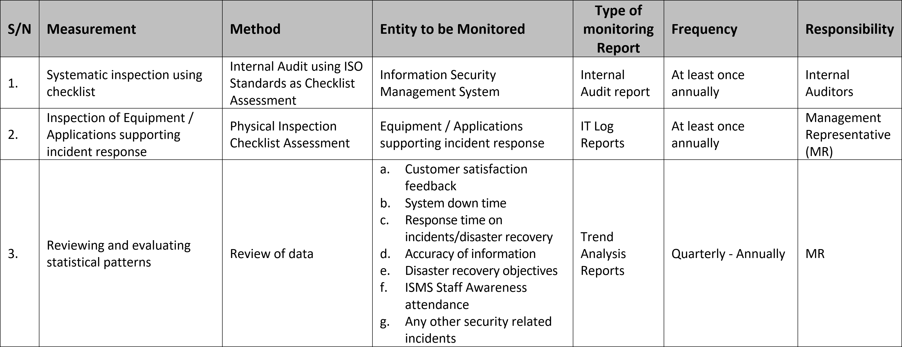

# Nexraid ISMS Procedure 07 - Performance Monitoring

## Document Details
* Doc ID: ISMSP07
* Doc Title: Performance Monitoring
* Revision: 1.0
* Effective Date: 1 July 2021
* Reference: ISO 27001 Clause 9.1
* Author: Danny Tan
* Approver: Liu Lung Hao

## Introduction
The ISMS would incorporate both proactive and reactive monitoring as follows:
1. Proactive monitoring to check conformity to the organisation information security activities.
2. Reactive monitoring to investigate, analyse and record information security management system failures.

## ISMS Performance Monitoring and Measurement - Methodology
1. Elements to be monitored include determining the extent to which:
    1. Resources supporting security incident response is well-calibrated and in working condition
    2. ISMS and Information Security (IS) procedures and policies are adhered to
    3. ISMS is meeting their stated objectives and key performance indicators (KPI)
    4. Personnel responsible for incident response within the company are adequately trained and competent
    5. Nonconformances, continuity related deteriorations, failures and incidents are pro-actively detected
2. To assist in performing proactive and reactive monitoring, the MR is to implement a process of routine measurements to monitor the performance of the ISMS. This shall be conducted through the use of:
    1. Systematic inspection using checklist
    2. Reviewing and evaluating logistics including statistical patterns
    3. Inspection of equipment supporting incident response to check that they are in good condition
    4. Analysis of documentation and records
    5. Stakeholder feedback
    6. Outsourced vendor contractual reviews 

## Performance Monitoring & Measurement Matrix
1. The MR is to develop and carry out the monitoring based on associated threats and risks from the Risk Assessment including potential deterioration mechanism and its consequences. The Performance Monitoring & Measurement Matrix Table (See Annex A) defines the following parameters for monitoring:
    1. entity to be monitored
    2. frequency of monitoring
    3. personnel responsibility to carry out the monitoring
    4. type of monitoring report
2. Spot checks of critical tasks are to be included as part of the measurement regime in order to assure conformity to procedures and codes of practice.

## Monitoring Reports
The MR is to complete a Monitoring Report after each measurement. The report is to detail any non-conformances to the ISMS and provide recommendations for improvement. Once measurement is completed, all monitoring report must reach the ISMS Steering Committee within 3 working days for reference and follow up guidance and action. The monitoring reports will determine whether the organisation’s ISMS objectives and KPIs continue to be relevant and effective as well as the extent to which the ISMS policy is met.

## Records
1. Completed Monitoring Schedule
2. Completed Monitoring Report

## Performance Monitoring & Measurement Matrix Table
