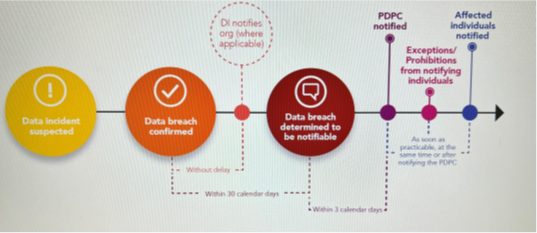

# Nexraid Information Security Policy 22 – Notification of Data Breach Involving Personally Identifiable Information (PII) Protection Policy

## Document Details
* Doc ID: ISP22
* Doc Title: Notification of Data Breach Involving Personally Identifiable Information (PII) Protection Policy
* Revision: 2.0
* Effective Date: 18 August 2022
* Author: Danny Tan
* Approver: Liu Lung Hao

## Introduction
The PII that NEXRAID processes to provide these services relates to its clients (public cloud service customers). This policy sets out NEXRAID’s commitment in the event of a data breach involving PII, notification is promptly carried out in compliance in accordance with ISO 27701:2019 requirements and applicable client contractual terms to notify relevant cloud service customer including PDPA breach notification requirement. NEXRAID ensures that good PII protection practices are imbedded in the culture of our staff and our organisation.

## Scope of this Procedure 
1. This procedure outlines the steps Nexraid Consulting Pte Ltd (“NEXRAID”) must observe when processing Personal Data where NEXRAID suspects or confirms that there has been a Data Breach.
2. This procedure applies to all employees, officers, vendors, consultants, contractors, volunteers, agency workers and anyone who has access to personal data, whether or not NEXRAID is the processor of the data.
3. Misuse of personal data not only damage the business and our reputation, but can result in a substantial fine from the Personal Data Protection Commission’s office (“PDPC”).
4. Any breach of this Procedure will be dealt with under our Disciplinary Procedure and, in serious cases, may be treated as gross misconduct leading to summary dismissal.
5. This Procedure does not form part of any employee's contract of employment and we may amend it at any time.

## Personnel Responsible for the Procedure
1. Our Director(s) has overall responsibility for the effective operation of this procedure and for ensuring compliance with the relevant statutory framework. Day-to-day responsibility for operating the procedure and ensuring its maintenance and review have been delegated to the Data Protection Officer.
2. Managers have a specific responsibility to ensure the fair application of this procedure and all members of staff are responsible for supporting colleagues and ensuring its success.
3. The IT Department will deal with requests for permission or assistance under any provisions of this procedure, and may specify certain standards of equipment or procedures to ensure security and compatibility.

## What is a Data Breach?
1. A personal data breach means a breach of the security around that data which leads to the accidental or unlawful destruction, loss, alteration, unauthorised disclosure of, or access to personal data.
2. It is an incident that affects the confidentiality, integrity or availability of personal data.
3. Breaches cover both accidental and deliberate actions.
4. Examples include:
    1. Access by an unauthorised person or third party;
    2. Deliberate or accidental action (or inaction) by a company;
    3. Sending personal data to the wrong person (including via email or post);
    4. Computers, phones, tablets and other such devices which contain personal data, being lost or stolen;
    5. Alteration of personal data without permission;
    6. Loss of availability of personal data such as lost keys, forgotten passwords, or corrupted files.

## Suspected Breaches
1. NEXRAID is responsible for the security of the equipment allocated to or used by NEXRAID, and must not allow it to be used by anyone else, other than in accordance with this Procedure.
2. If NEXRAID suspects a data breach has taken place, NEXRAID must immediately inform the Data Protection Officer. Where the Data Protection Officer is not contactable, NEXRAID must inform the next most senior manager available.
3. Where possible, NEXRAID should attempt to retrieve the data if it was emailed to the wrong person, or placed in the post and it can be located/retrieved.
4. To retrieve an email NEXRAID should:
    1. open the sent message and locate the “actions” button at the top of the screen;
    2. Click on “actions” and there will be the option to “Recall this message”;
    3. Click on this option and follow the steps on screen to “delete unread copies of this message” as soon as possible;
    4. Where a recall is successful, NEXRAID will receive a notification; and
    5. Whether or not NEXRAID is successful, NEXRAID must inform the Data Protection Officer of the result.

## Reported Breaches
1. Where a breach or suspected breach is reported, the Data Protection Officer will investigate the report and determine whether there has been a breach at all.
2. The Data Protection Officer will take all necessary and available steps to retrieve, recover or fix the data breach. All staff must assist the Data Protection Officer as much as possible in order to minimize the effect of the breach. For example:
    1. If a computer has been lost, the Data Protection Officer will check if it was password protected. If possible, the IT manager or service provider will remotely wipe any data from the device to end the breach; and
    2. If a person has accessed a part of the computer system without authorisation, all related passwords will be changed.

## Record of Breaches
1. All suspected breaches will be recorded by the Data Protection Officer and any necessary steps to avoid a future breach of the same kind, will be considered, and implemented.
2. Where a breach has taken place, and it is not required to notify the PDPC and/or the data subject, the Data Protection Officer will make a record of the breach which will include:
    1. What happened;
    2. Who was involved;
    3. How it happened;
    4. What steps were taken to resolve the breach; and
    5. What decisions were taken in relation to reporting the breach.

## Notification of Breaches to Data Subject/PII Principal 
1. Where the breach is likely to result in significant harm or impact to the data subject to whom the information relates, PDPC will be notified of the breach and thereafter to data subject.1. The Data Protection Officer will investigate and determine whether the breach is likely to result in significant harm or impact to the individuals to whom the information relates. If so, no notification will be sent and a record of this decision will be made which will include the details set out in clause 6 above.
2. When the data subject is notified of a breach, they will be notified in clear, plain language:
    1. The nature of the data breach;
    2. The name and contact details of the Data Protection Officer;
    3. A description of the likely consequences of the breach; and
    4. A description of the steps taken or planned, to deal with the data breach.

## Reporting Breaches to the PDPC
1. When a breach occurs that is considered likely to cause risk to the data subject, the breach must be reported to the PDPC as soon as applicable no later than 72 hours as suggested by PDPC guidelines. This is known as a notifiable breach. 
2. All decisions in relation to breaches will recorded and such records maintained and stored by the Data Protection Officer.
3. Reporting a breach to the PDPC must include:
    1. A description of the nature of the breach including the types of people and number of people affected and the types of data and number of records concerned;
    2. The name and contact details of the Data Protection Officer;
    3. A description of the likely consequences of the breach; and
    4. A description of the steps taken or planned in order to deal with the data breach.

## Flowchart for Data Breach Notification and Timelines

## Criteria for Data Breach Notification 
### Significant Harm to Affected Individuals
To assess whether a data breach is notifiable as it is likely to result in significant harm (Significant harm could include physical, psychological, emotional, economic and financial harm, as well as harm to reputation and other forms of harms that a reasonable person would identify as a possible outcome of a data breach) to the affected individuals as given the likelihood of harm arising from a data breach, notification is to ensure that affected individuals are aware and able to take steps to protect themselves (e.g., change password, cancel credit card, monitor account for unusual activities). To provide certainty to organisations on the data breaches that are notifiable, the PDP (DBN) Regulations 2021 provides the personal data (or classes of personal data) that is deemed to result in significant harm to affected individuals if compromised in a data breach. Where a data breach involves any of the prescribed personal data, it is required to notify the affected individuals and the Commission of the data breach. 
### Significant Scale
Data breaches that meet the criteria of significant scale are those that involve the personal data of 500 or more individuals. Where a data breach affects 500 or more individuals, required to notify the Commission, even if the data breach does not involve any prescribed personal data in the PDP (DBN) Regulations 2021. If unable to determine the actual number of affected individuals in a data breach, should notify the Commission when it has reason to believe that the number of affected individuals are at least 500. This may be based on the estimated number from an initial appraisal of the data breach. Thereafter update the Commission of the actual number of affected individuals when it is established.

## Review of Breaches
1. Once an investigation (and reporting where applicable) of a breach is complete, the Data Protection Officer will review what happened and consider and implement any steps/processes which need to be taken to ensure that the same does not happen again.
2. If the breach is due to the deliberate actions of anyone listed in clause 2.2 above, disciplinary action may be taken in accordance with the company disciplinary policy. Such action may include summary dismissal for gross misconduct.

## Monitoring and Review
This policy shall be regularly monitored and reviewed, at least once every year including conduct of data breach exercise based on a probably scenario at least once annually.